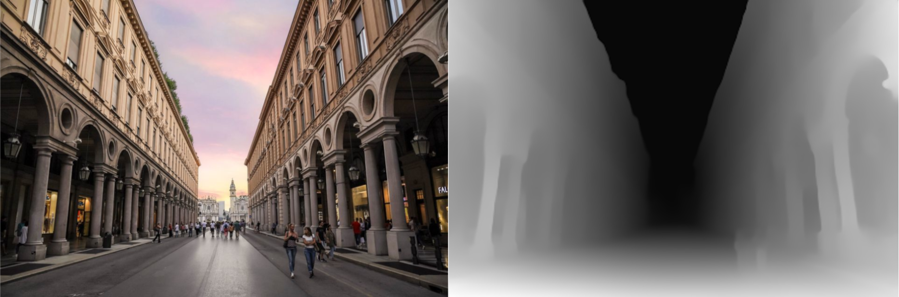
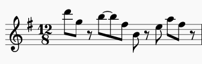
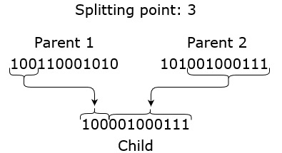

# Synthetic Spaces
**Synthetic Spaces** is a web app installation born as a reflection on the concept of space; a concept that has played a fundamental role in the recent pandemic situation due to the movement restrictions.
We were interested in exploring the audio and visual interaction, the capability of music to evoke virtual spaces and the power of point clouds in suggesting volumes and shapes. 

Our main inspirations were the work of all those artists who try to connect art and science, in particular those focusing on the point clouds aesthetic (such as [Fuse](https://www.fuseworks.it/) or [Benjamin Bardou](https://benjaminbardou.com/), to name a few).

The project was born during the *Creative Programming and Computing 2020 Hackaton* and was initially thought (and prototyped) as a physical installation, realized with different tools such as TouchDesigner and Ableton Live. We then decided, coherently with the underlying motivation, to move to a web application in order to make the experience accessible to everyone.

## Project specifics
As already mentioned the project is a web-based application, written in HTML, CSS and Typescript. All the code and the assets are then bundled through Webpack and hosted on a Github Page.

The graphics are rendered in real time using [Three.js](https://github.com/mrdoob/three.js) and some custom shaders written in GLSL and loaded through [Glslify](https://github.com/glslify/glslify).

The audio engine is built using [Tone.js](https://github.com/Tonejs/Tone.js) and runs on top of the rendering animation.

## How to use?
The code was tested on Google Chrome 90.0.4430.93, running at 60fps. Also other Chromium based browsers such as Edge and Opera worked fine.

Since the rendering of the point cloud is a quite heavy task, we suggest the use of hardware acceleration (external GPU if available) in Chrome to avoid possible issues such as latency or audio clicking.
We also suggest the use of headphones in order to better enjoy the experience as it was conceived.

### User controls

`SPACEBAR` start 

`→` Move to next city

`←` Move to previous city

_(To manually select the city you can use the menu accessible by passing over the drawer at the bottom)_

`wheel` Modify the depth

`mousemove` change camera orientation

`d` trigger special effect 'collapse'

## Visual
Depth estimation has been an important field of research in the last years for its applications in the field of AR, autonomous drive and 3D scene reconstruction.
Our idea was to create a virtual 3D scene starting from a 2D image.

We associated each image to a grid where every pixel was represented by a point with its color. The point depth was then added by sampling a depth map loaded as a texture. 
All the depth maps were retrieved using the [MiDaS Network](https://github.com/intel-isl/MiDaS), developed by Intel and hosted on TorchHub. 

This is an example of a depth map obtained from a picture:

The scene contains a Mesh, made of (_width * height_) points. 
Each point has as attributes its (x,y,z) coordinates and its random generated normal directions, that are used later to animate the transition.
The material applied onto the mesh is a custom shader material that we specifically wrote in GLSL.
The shader is composed by a vertex shader, applied equally to each vertex in the mesh and a fragment shader, responsible of the coloring of the scene after the rasterization of the vertices.
Since the same code is applied to each vertex by the GPU, we could not access directly to time varying variables. For this reason, we created a set of uniforms that are changed at run time by the CPU and are then passed to the shader.
This way we could control and modify the point cloud as time passes by changing the uniforms that the shader can read.

In order to change image, the shader needs to move smoothly from one image to another. When the animation is triggered, a timer starts and the transition is created by ramping through a double exponential function that starting from 0 spreads the points along their normal directions until a maximum is reached, and then saturates to 1. This way we can interpolate between the images using the _mix()_ function in webGL, that allowed us to move from image at position 0 and image at position 1.
When the user changes again the image, the image that was at index 1 goes at index 0 and the timer is reset.

## Audio
The audio composition is generated by three elements: 
- **Pad**: a PolySynth object from Tone.js, with pwm oscillators (a PulseOscillator with frequency modulated width). Four voices are played according to the rhytmic structure, with each voice randomly spreading among different octaves and major third intervals to make it more dynamic.

- **Melody**: a MonoSynth object from Tone.js, with a triangle oscillator. The melody notes are pre-determined in the different metrics subdivision while the rhythmic structure follows a genetic algorithm described below.

- **Sample Player**: Contains two samplers and a granular player both playing samples created by us in Ableton Live.

### Rhythmic Structure
For each element a **Rhythmic Structure** is provided. This rhytmic structure is a sequence of *0* (doesn't trigger a note) and *1* (trigger a note/sampler);  with the addition of the symbol *2* (trigger the granular player) only for the Sample Player.

To manage this difference in symbols the rhythmic structure is first generated from a Genetic algorithm (more on this later) and provided to the Pad and the Melody, then it's fed to a simple **L-System** to expand it with the addition of the *2* symbol and provided to the Sample Player. 
The rules of the L-System are the following:
- 0 -> 0
- 1 -> 01, 10, 11, 12
- 2 -> 02, 20, 22

All the elements are sequenced thanks to the [Loop](https://tonejs.github.io/docs/14.7.77/Loop.html) class provided by Tone.js. More in detail each element's sequencing loop is of different durations (half-note for the Pad, quarter-note for the Melody and one measure for the Sample Player) and at every loop the rhythmic structure is analyzed to decide wether the element should play a note or not.

Both the Pad and the Sample Player maintain the same rhythmic structure, while for the Melody it changes at each loop iteraction following a **Genetic Algorithm**. We can subdivide the algorithm into five main steps:

- **Population initialization**: 12 different sequences (of length 12) are randomly generated

- **Fitness Evaluation**: for all the element of the population the fitness is calculated. The fitness function considered is _"be as similiar as possible to Steve Reich's 'Electric Counterpoint' main theme rhytmic structure"_.

  

- **Mating Pool creation**: out of the 12 sequences of the population only 4 are selected as parents of the next generation. The selection is made following the probabilistic approach, in which all elements have a probability of being selected correspondent to their normalized fitness. By using this approach we give more probability of being selected to the fittest sequences but still allowing variety.

- **Crossover**: The selected 4 parents genetic codes are combined to generate new children following a random splitting point approach. The scheme below better explain the procedure.

  

- **Mutation**: Each element of the sequence has a probability to mutate (from 0 to 1 and viceversa) that is given by the mutation rate, set as 0,2.

The generated children become the new population and the algorithm iterate again from the Fitness Evaluation step. The actual melody rhythmic structure is selected after the Fitness Evaluation step as the fittest one.

## Weather Data
To further enhance the immersivity, we incorporated real time weather data from the selected city. 
The data is retrieved using the [OpenWeatherMap API](https://openweathermap.org/).

Every time the user changes the city, the weather is retrieved and it affects both audio and visual. In particular the mode in which Pad and Melody are playing will change accordingly to the table below.

| Weather       | Mode          | Chord | Effect |
| ------------- |:-------------:| :-----:| :-----:|
| Clear         | Ionian        | maj   | Brighten |
| Clouds        | Dorian        |   powerchord | Darken |
| Rain          | Aeolian       |    min7 | Drops+Darken |
| Snow          | Myxolidian    |    maj13 | Whiten+Drops |
| Mist          | Phrygian      |    min11 | Murky |
| Extreme       | Locrian       |    m7b/b5 | Collapse |
| Default       | Lydian        |    aug4 | None |

The effects are applied in the shader.

- Brighten: multiply each pixel by a certain value.

- Darken: divide each pixel by a certain value.

- Drops: random pixels increase their dimension as if they were hit by a rain drop.

- Whiten: adds a white overlay and animates as the rain condition.

- Murky: adds a grey overlay.

- Collapse: since the extreme state is associated to catastrophical events such as earthquakes, we mapped it to the locrian mode (notably the most dissonant). Also the point cloud will "collapse" while a frequency shifter is applied to the whole audio stream. This weather condition is extremely rare, so the user can activate it manually using the `d` key.

Images
## Interactions 

User can rotate the camera with the mouse. This orientation will also affect the panning of the audio, as if the speaker was oriented together with the center of the point cloud and moving consequently.

## Considerations

### Known issues
As far as we know, Safari is not supported. 

The whole app is quite heavy. A better way could have been using FBO particles thus a GPGPU approach as suggested in [this blog post](http://barradeau.com/blog/?p=621) by Nicolas Barradeau.
If you are interested, Mario Carrillo did a porting of the original code to ES6. Give it a look [here](https://github.com/marioecg/gpu-party/). Basically instead of reading the position attribute from the CPU, the position of the particles is rendered as a texture off-screen and passed directly to the shader, so computation will mostly happen on the GPU. Also animations will happen by changing the position texture.

## Run on your machine
Requirements: Node.js and an active account with an API access key to OpenWeatherMap. 

- Clone the repo
- Create a .env file with the following format: `KEY_WEATHER = ' ... '`
- Run npm install ....
- Run npm start and build on your local host
